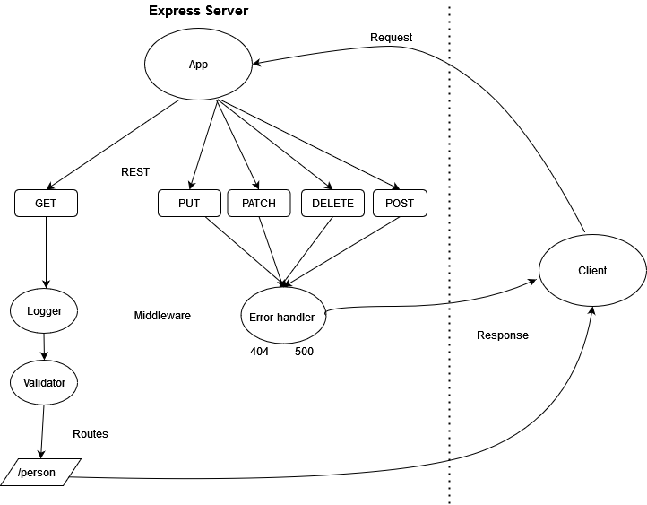

# Basic Express Server

## Installation

  clone repo, and then run the 'npm i' command while in root directory to install dependencies.

## Summary of Problem Domain

  Application created with the purpose of testing middlware and routes as well as practicing the CI/CD of a web application.

## Links to application deployment

  App deployed on Heroku [here](https://basic-express-server-lab02.herokuapp.com/)

  Pull req from dev found [here](https://github.com/Beers15/basic-express-server/pull/1)

## Uml Diagram

## Routes

* HTTP GET
  * Path: /person
    * recieves input for person name and after validation sends json response in the format {name: "recieved name here"}
